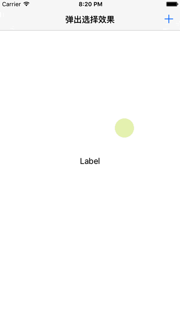

#弹出选择框
简单封装弹出选择框,使用效果如下:  

  

使用说明
========
###导入文件
将项目根目录下SelectList导入项目文件,主要文件如下:  
`SISelectListItem`:数据模型  
`SISelectListCell`:显示的cell  
`SISelectListViewController`:控制器   

###导入头文件
	#import "SISelectListItem.h"
	#import "SISelectListViewController.h"  

###创建ViewController
	selectVC = [[SISelectListViewController alloc]initWithItem:_selectArray]
	
###设置对应属性
`items`:数据源对象  
`showListViewController`:在哪个viewController显示  
`clickBlock`:点击回调  
`alphaComponent`:背景透明度  
`backgroudName`:弹出框背景图片的名称

###使用
1. 使用  `- (instancetype)initWithItem:(NSArray <SISelectListItem *> *)items`  构建对象
2. 显示调用`- (void)show`弹出
3. 定义`void(^SelectListClickBlock)(NSInteger selectIndex)`进行回调

